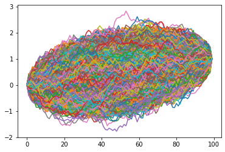
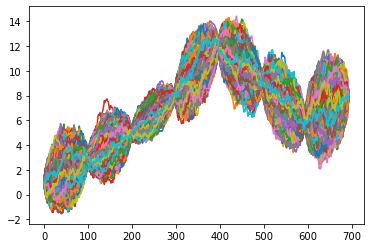

# Brownian_Bridge_simulation

## Description

This repository contains a Python script for simulating a Brownian bridge process. The Brownian bridge is a key concept in stochastic processes and has applications in financial modeling and statistical analysis. The repository includes code for generating and visualizing sample paths of the Brownian bridge.

## Functions

1. **bridge(M, N, t1, t2, a, b)**:
    - Interpolates between two known points and constructs one Brownian bridge.

2. **multibridge(M, N, nodes, times)**:
    - Constructs multiple Brownian bridges between the specified nodes and times.

3. **parallel_multibridge(M, N, nodes, times)**:
    - Utilizes parallel computing to construct multiple Brownian bridges efficiently.

## Installation

To use this script, ensure you have Python and the necessary libraries installed. You can install the required libraries using pip:

```bash
pip install numpy matplotlib
```

# Brownian Bridge construction 
In simple terms, a Brownian Bridge is a method for interpolating or filling in the path of a Brownian motion between two fixed points in time, where the start and end points of the motion are known. In the Brownian Motion framework, we focus on simulating values $(W_{t_{1}}, \ldots, W_{t_{n}})$ at a fixed set of points $t_1, ..., t_n$ using independent standard normal random variables $(Z_1, \ldots, Z_n)$. Consider we set $t_0 = 0$ and $W(0)=0$ then the subsequent values can be generated as :
    $W(t_{i+1}) = W(t_i) + \sqrt{t_{i+1} - t_i}Z_{i+1}, \quad i = 0, \ldots, n-1$.
    
This equation creates the vector $(W_{t_{1}}, \ldots, W_{t_{n}})$ from left to right. Instead of traditionally computing the values of Brownian motion at consecutive times in a sequential manner, we can opt for a more flexible approach by generating the values of Brownian motion $W_{t_{i}}$ at predetermined times in any sequence we prefer, as long as we adhere to the correct conditional probability distributions based on the values that have already been calculated. For instance, we could start by determining the value at the final time point $W_{t_{n}}$, compute the value at the midpoint time $W_{t_{n/2}}$ based on $W_{t_{n}}$ and then continue to fill in the rest of the intermediate values. 

Conditioning a Brownian Motion on its end points produces a Brownian Bridge. By first establishing the value at the final time point $t_n$, we can then proceed to interpolate the values at intermediate points, essentially creating a Brownian Bridge from the starting point $t_0 = 0$ to the end point $t_n$ we have set. If we further choose to determine the value at the midpoint time $t_{n/2}$, and then interpolate the values in the interval between this midpoint and $t_n$, we are effectively constructing another Brownian Bridge, this time between the midpoint and the final value. 

Suppose that the values $\(W(s_1) = x_1, W(s_2) = x_2, \ldots, W(s_k) = x_k\)$ of the Brownian path have been determined at the times $s_1 < s_2 < \ldots < s_k$ and we're interested in the value of $W(s)$ at some time within this sequence. We can conditionally sample this value based on the already known points. Suppose that $s_i < s < s_{i+1}$, then : 

$$
(W(s) \mid W(s_j) = x_j, j = 1, \ldots, k) = (W(s) \mid W(s_i) = x_i, W(s_{i+1}) = x_{i+1})
$$

Which implies from the conditioning formula:

$$
(W(s) \mid W(s_1) = x_1, W(s_2) = x_2, \ldots, W(s_k) = x_k) = \mathcal{N}\left(\frac{(s_{i+1} - s)x_i + (s - s_i)x_{i+1}}{s_{i+1} - s_i}, \frac{(s_{i+1} - s)(s - s_i)}{s_{i+1} - s_i}\right)
$$


Where actual value of $W(s)$ is normally distributed around the conditional mean of the straight line that joins $(s_i, x_i)$ and $(s_{i+1}, x_{i+1})$ with a variance that is influenced by $(s - s_i)$ and $(s_{i+1} - s)$. To draw a sample from this conditional distribution we set : 

$W(s) = \frac{(s_{i+1} - s)x_i + (s - s_i)x_{i+1}}{s_{i+1} - s_i} + \sqrt{\frac{(s_{i+1} - s)(s - s_i)}{s_{i+1} - s_i}} Z,$

with $Z \sim \mathcal{N}(0, 1)$ being independent of all $W(s_1), \ldots, W(s_k)$.

# Plots

### Single bridge Plot


### Multibridge Plot



